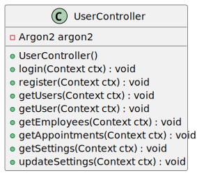

# Controllers (Steuerungen)
In diesem Dokument werden die verschiedenen Controller-Klassen des Systems beschrieben. Diese Klassen sind verantwortlich für das Verarbeiten von HTTP-Anfragen und das Zurückgeben von Antworten sowie das prüfen von Berechtigungen und das Validieren von Daten. Jeder Controller ist für einen bestimmten Bereich der Anwendung zuständig und enthält die entsprechenden Endpunkte, jeder Controller hat seinen eigenen Service, der die Logik hinter den Endpunkten implementiert.

## Übersicht

### TransactionController
Der `TransactionController` ist dafür zuständig, Transaktionsanfragen zu verarbeiten. Er bietet Endpunkte zum Erstellen, Abrufen, Aktualisieren und Generieren von Transaktionsberichten.

!

---

## 1. TransactionController

!

### Beschreibung
Der `TransactionController` ist dafür zuständig, Transaktionsanfragen zu verarbeiten. Er bietet Endpunkte zum Erstellen, Abrufen, Aktualisieren und Generieren von Transaktionsberichten.

### Methoden

#### `createTransaction(Context ctx)`
- **Beschreibung**: Erstellt eine neue Transaktion mit Validierungsprüfungen.

- **Validierungen**:
  - Benutzer-ID muss vorhanden sein.
  - Kunden-ID muss vorhanden sein.
  - Zeitstempel muss in der Vergangenheit liegen.
  - Zeitstempel muss innerhalb der letzten 90 Tage liegen.
- **Log-Eintrag**: Ein Log-Eintrag wird erstellt, wenn eine Transaktion erfolgreich erstellt wurde.

#### `getTransactions(Context ctx)`
- **Beschreibung**: Ruft eine Liste von Transaktionen ab, die den angegebenen Kriterien entsprechen.

- **Kriterien**:
  - Benutzer-ID (optional)
  - Kunden-ID (optional)
  - Status (optional)

#### `getTransaction(Context ctx)`
- **Beschreibung**: Ruft eine Transaktion anhand ihrer ID ab.

- **Fehlerbehandlung**:
  - Gibt einen Fehler zurück, wenn die Transaktion nicht gefunden oder die ID ungültig ist.

#### `updateTransaction(Context ctx)`
- **Beschreibung**: Aktualisiert den Status einer Transaktion.

- **Validierung**:
  - Prüft, ob der Statuswechsel gültig ist.
- **Log-Eintrag**: Ein Log-Eintrag wird erstellt, wenn die Transaktion erfolgreich aktualisiert wurde.

#### `generateReport(Context ctx)`
- **Beschreibung**: Generiert einen Transaktionsbericht basierend auf den bereitgestellten Kriterien.

---

## 2. LogController

!

### Beschreibung
Der `LogController` ist dafür zuständig, Log-Anfragen zu verarbeiten. Er bietet Endpunkte zum Abrufen von Systemlogs.

### Methoden

#### `getLogs(Context ctx)`
- **Beschreibung**: Ruft Logs aus dem System ab, basierend auf den bereitgestellten Kriterien.

---

## 3. AppointmentController

!

### Beschreibung
Der `AppointmentController` ist dafür zuständig, Terminanfragen zu verarbeiten. Er bietet Endpunkte zum Erstellen, Aktualisieren und Löschen von Termineinträgen.

### Methoden

#### `createAppointment(Context ctx)`
- **Beschreibung**: Erstellt einen neuen Termin basierend auf den Anforderungsdaten.

- **Validierungen**:
  - Start- und Enddatum müssen in der Zukunft liegen.
  - Mindestens ein Teilnehmer muss angegeben sein.
  - Eine Beschreibung darf nicht leer sein.

#### `updateAppointment(Context ctx)`
- **Beschreibung**: Aktualisiert einen bestehenden Termin.

- **Validierung**:
  - Partielle Aktualisierungen werden unterstützt.

#### `deleteAppointment(Context ctx)`
- **Beschreibung**: Löscht einen Termin.

- **Berechtigungsprüfung**:
  - Nur Organisatoren oder Administratoren können Termine löschen.

---

## 4. CustomerController

!

### Beschreibung
Der `CustomerController` ist dafür zuständig, Kundenbezogene Anfragen zu verarbeiten. Er bietet Endpunkte zum Erstellen, Lesen, Aktualisieren und Löschen von Kunden.

### Methoden

#### `createCustomer(Context ctx)`
- **Beschreibung**: Erstellt einen neuen Kunden.

- **Validierungen**:
  - Name, Nachname, E-Mail und Unternehmen sind erforderlich.

#### `getCustomers(Context ctx)`
- **Beschreibung**: Ruft alle Kunden ab.

#### `getCustomer(Context ctx)`
- **Beschreibung**: Ruft einen bestimmten Kunden anhand seiner ID ab.

#### `updateCustomer(Context ctx)`
- **Beschreibung**: Aktualisiert einen bestehenden Kunden.

#### `deleteCustomer(Context ctx)`
- **Beschreibung**: Löscht einen Kunden.

#### `getCustomerAppointments(Context ctx)`
- **Beschreibung**: Ruft alle Termine eines bestimmten Kunden ab.

---

## 5. UserController

!

### Beschreibung
Der `UserController` ist dafür zuständig, Benutzerbezogene Operationen wie Login, Registrierung, Abruf von Benutzern und Aktualisierung von Einstellungen zu verwalten.

### Methoden

#### `login(Context ctx)`
- **Beschreibung**: Verarbeitet den Benutzerlogin.

- **Validierung**:
  - E-Mail und Passwort sind erforderlich.

#### `register(Context ctx)`
- **Beschreibung**: Registriert einen neuen Benutzer.

- **Validierung**:
  - E-Mail, Passwort, Name, Nachname und Rolle sind erforderlich.

#### `getUsers(Context ctx)`
- **Beschreibung**: Ruft alle Benutzer ab und gibt sie als DTO-Liste zurück.

#### `getUser(Context ctx)`
- **Beschreibung**: Ruft einen bestimmten Benutzer anhand seiner ID ab.

#### `getEmployees(Context ctx)`
- **Beschreibung**: Ruft alle Mitarbeiter ab.

#### `getAppointments(Context ctx)`
- **Beschreibung**: Ruft alle Termine eines bestimmten Benutzers ab.

#### `getSettings(Context ctx)`
- **Beschreibung**: Ruft die aktuellen Benutzereinstellungen ab.

#### `updateSettings(Context ctx)`
- **Beschreibung**: Aktualisiert die Benutzereinstellungen.

--- 

## Erweiterung der Controller

Um die Controller zu erweitern, können neue Methoden hinzugefügt werden, die spezifische Anforderungen erfüllen. Jede Methode sollte die entsprechenden Validierungen und Berechtigungsprüfungen implementieren, um sicherzustellen, dass nur autorisierte Benutzer auf bestimmte Funktionen zugreifen können, bevor die Logik des Controllers ausgeführt wird. Die Methode muss registriert werden, um sie über die API verfügbar zu machen,
siehe `Javalin.create()` in der `Main.java`-Datei.

Falls sie mehr Informationen zu den einzelnen Endpunkten benötigen, schauen Sie in die [Anfragen-Dokumentation](requests/overview) oder in die [Dienste-Dokumentation](services).