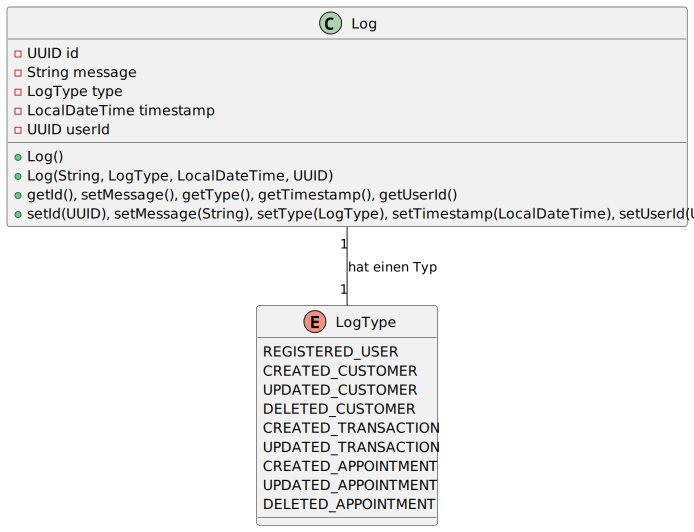
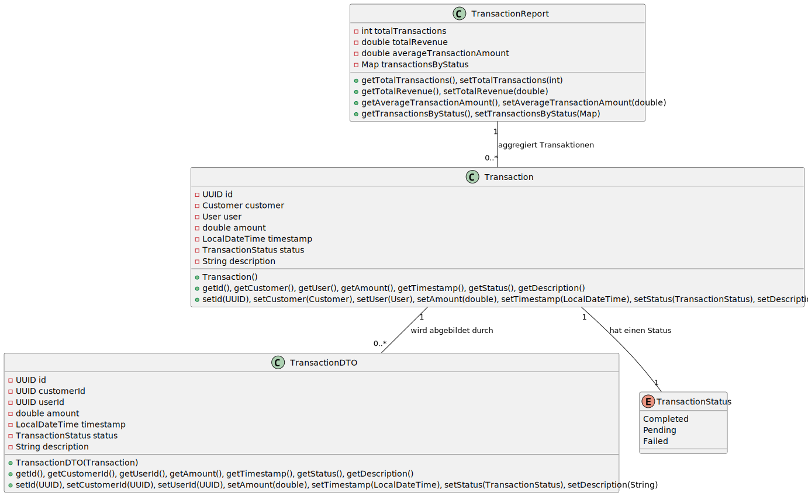
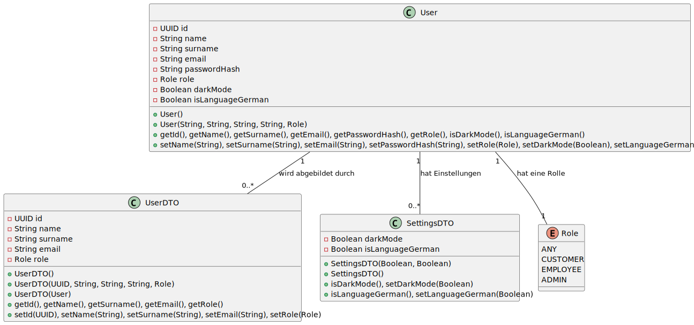
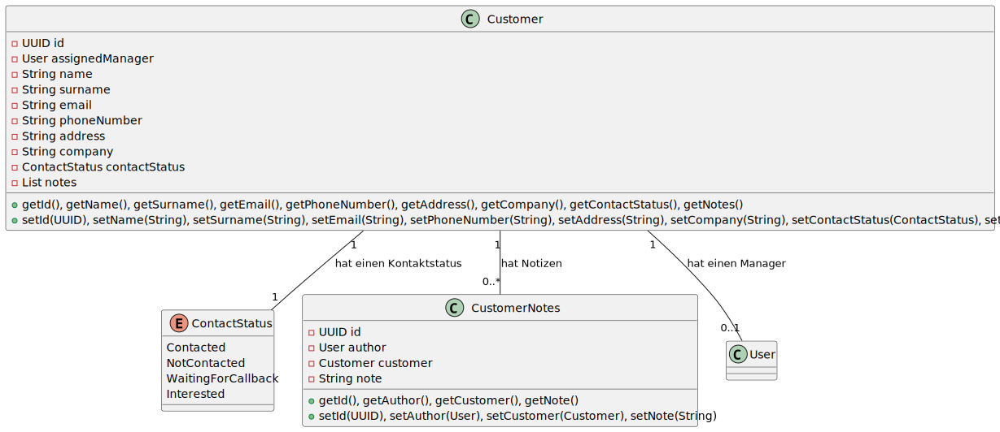
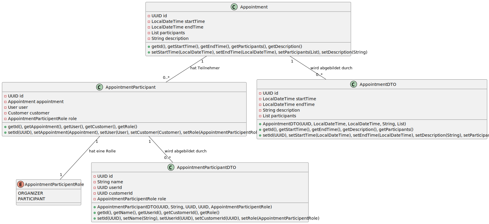

# Datenbank

Die Datenbank von Worksale ist auf einer relationalen Datenbankstruktur (PostgreSQL) basiert und durch Hibernate via Jakarta Annotations generiert wird. Diese Ansatz ermöglicht eine flexible und skalierbare Architektur, die sich an wachsenden Anforderungen und Bedürfnissen anpassen kann. Die Struktur der Datenbank wird durch die definierten Modelle im Code bestimmt, welche in logische Pakete unterteilt sind, um eine klare Trennung der Verantwortlichkeiten zu gewährleisten. Da die Struktur durch die Modelle definiert ist, wird sie nicht in SQL-Skripten festgehalten, sondern direkt im Code implementiert und entfernt eine mögliche Diskrepanz zwischen Code und Datenbankstruktur.

## Modellstruktur

Modelle beschreiben die Direkte Datenstruktur in der Datenbank so wie sie von Hibernate generiert wird. Sie sind in Pakete unterteilt, die verschiedene Aspekte des Systems repräsentieren.

#### 1. `models`
Dieses Paket enthält grundlegende Modelle für das System.

- **Role.java**
    - Definiert Rollen für Benutzer im System.
    - Enum-Werte: `ANY`, `CUSTOMER`, `EMPLOYEE`, `ADMIN`.

!
- **Log.java**
    - Repräsentiert Log-Einträge im System.
    - Attribute:
        - `id`: UUID des Logs (Primärschlüssel).
        - `message`: Nachricht des Logs.
        - `type`: Typ des Logs (`LogType`).
        - `timestamp`: Zeitstempel des Logs.
        - `userId`: ID des Aktors/Benutzers.

- **LogType.java**
    - Enum, das verschiedene Typen von Log-Einträgen definiert.
    - Werte: `REGISTERED_USER`, `CREATED_CUSTOMER`, `UPDATED_CUSTOMER`, `DELETED_CUSTOMER`, `CREATED_TRANSACTION`, `UPDATED_TRANSACTION`, `CREATED_APPOINTMENT`, `UPDATED_APPOINTMENT`, `DELETED_APPOINTMENT`.

#### 2. `models.transactions`
Dieses Paket enthält Modelle, die mit Transaktionen im System zusammenhängen.

!
- **Transaction.java**
    - Repräsentiert eine Transaktion.
    - Attribute:
        - `id`: UUID der Transaktion (Primärschlüssel).
        - `customer`: Kunde, der an der Transaktion beteiligt ist.
        - `user`: Benutzer, der die Transaktion durchgeführt hat.
        - `amount`: Betrag der Transaktion.
        - `timestamp`: Zeitstempel der Transaktion.
        - `status`: Status der Transaktion (`TransactionStatus`).
        - `description`: Beschreibung der Transaktion.

- **TransactionDTO.java**
    - Data Transfer Object für Transaktionen.
    - Enthält nur relevante Informationen für die Darstellung.

- **TransactionReport.java**
    - Repräsentiert einen Bericht über Transaktionen.
    - Attribute:
        - `totalTransactions`: Gesamtanzahl der Transaktionen.
        - `totalRevenue`: Gesamteinnahmen aus Transaktionen.
        - `averageTransactionAmount`: Durchschnittlicher Transaktionsbetrag.
        - `transactionsByStatus`: Anzahl der Transaktionen nach Status gruppiert.

- **TransactionStatus.java**
    - Enum, das verschiedene Status einer Transaktion definiert.
    - Werte: `Completed`, `Pending`, `Failed`.

#### 3. `models.users`
Dieses Paket enthält Modelle, die mit Benutzern im System zusammenhängen.

!

- **User.java**
    - Repräsentiert einen Benutzer.
    - Attribute:
        - `id`: UUID des Benutzers (Primärschlüssel).
        - `name`: Vorname des Benutzers.
        - `surname`: Nachname des Benutzers.
        - `email`: E-Mail-Adresse des Benutzers.
        - `passwordHash`: Hash des Passworts des Benutzers.
        - `role`: Rolle des Benutzers (`Role`).
        - `darkMode`: Dark Mode-Einstellung des Benutzers.
        - `isLanguageGerman`: Spracheinstellung des Benutzers (Deutsch).

- **UserDTO.java**
    - Data Transfer Object für Benutzer.
    - Enthält nur relevante Informationen für die Darstellung.

- **SettingsDTO.java**
    - Repräsentiert die Einstellungen eines Benutzers.
    - Attribute:
        - `darkMode`: Dark Mode-Einstellung.
        - `isLanguageGerman`: Spracheinstellung (Deutsch).

#### 4. `models.customers`
Dieses Paket enthält Modelle, die mit Kunden im System zusammenhängen.

!

- **ContactStatus.java**
    - Enum, das verschiedene Kontakttypen definiert.
    - Werte: `Contacted`, `NotContacted`, `WaitingForCallback`, `Interested`.

- **CustomerNotes.java**
    - Repräsentiert Notizen zu einem Kunden.
    - Attribute:
        - `id`: UUID der Notiz (Primärschlüssel).
        - `author`: Autor der Notiz.
        - `customer`: Kunde, dem die Notiz zugeordnet ist.
        - `note`: Inhalt der Notiz.

- **Customer.java**
    - Repräsentiert einen Kunden.
    - Attribute:
        - `id`: UUID des Kunden (Primärschlüssel).
        - `assignedManager`: Zugeteilter Manager des Kunden.
        - `name`: Vorname des Kunden.
        - `surname`: Nachname des Kunden.
        - `email`: E-Mail-Adresse des Kunden.
        - `phoneNumber`: Telefonnummer des Kunden.
        - `address`: Adresse des Kunden.
        - `company`: Firma des Kunden.
        - `contactStatus`: Kontakttyp des Kunden (`ContactStatus`).
        - `notes`: Liste der Notizen zum Kunden.

#### 5. `models.appointments`
Dieses Paket enthält Modelle, die mit Terminen im System zusammenhängen.

!

- **Appointment.java**
    - Repräsentiert einen Termin.
    - Attribute:
        - `id`: UUID des Termins (Primärschlüssel).
        - `startTime`: Startzeit des Termins.
        - `endTime`: Endzeit des Termins.
        - `participants`: Liste der Teilnehmer am Termin.
        - `description`: Beschreibung des Termins.

- **AppointmentParticipant.java**
    - Repräsentiert einen Teilnehmer an einem Termin.
    - Attribute:
        - `id`: UUID des Teilnehmers (Primärschlüssel).
        - `appointment`: Termin, an dem der Teilnehmer teilnimmt.
        - `user`: Benutzer, wenn der Teilnehmer ein Benutzer ist.
        - `customer`: Kunde, wenn der Teilnehmer ein Kunde ist.
        - `role`: Rolle des Teilnehmers (`AppointmentParticipentRole`).

- **AppointmentParticipentRole.java**
    - Enum, das verschiedene Rollen von Teilnehmern definiert.
    - Werte: `ORGANIZER`, `PARTICIPANT`.

- **AppointmentDTO.java**
    - Data Transfer Object für Termine.
    - Enthält nur relevante Informationen für die Darstellung.

- **AppointmentParticipantDTO.java**
    - Data Transfer Object für Teilnehmer.
    - Enthält nur relevante Informationen für die Darstellung.

## Erweiterung der Datenbankstruktur

Um ein neues Modell zu erstellen, wird eine Java-Klasse erstellt, die die Attribute und Beziehungen des Modells definiert. Diese Klasse wird dann mit den entsprechenden Hibernate/Jakarta-Annotationen versehen, um die Datenbankstruktur automatisch zu generieren. Die Annotationen bestimmen unter anderem den Tabellennamen, die Spaltennamen, die Datentypen sowie die Beziehungen zu anderen Modellen.

Falls die neue Klasse als Entity deklariert wird, muss sie außerdem zur **Persistence Unit** in der `persistence.xml`-Datei hinzugefügt werden. Dies ist erforderlich, damit Hibernate die Klasse bei der Initialisierung erkennt und die zugehörige Tabelle in der Datenbank erstellt oder aktualisiert.

Weitere Informationen zu Persistence Units und der Konfiguration von Entities finden Sie in der [Dokumentation zu Hibernate](https://docs.jboss.org/hibernate/orm/6.6/introduction/html_single/Hibernate_Introduction.html#hello-jpa).