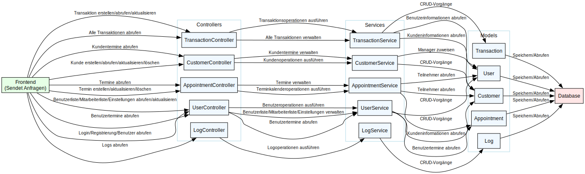

# Backend-Einführung
Dieses Kapitel bietet eine kurze Einführung in die Backend-Struktur des Worksale-Projekts.

### Technologien
- **Programmiersprache**: Java
- **Build-Tool**: Gradle
- **Web-Framework**: Javalin ,ein einfaches und leistungsfähiges Framework für die Erstellung von REST-APIs
- **Datenbank**: PostgreSQL performantes und zuverlässiges relationales Datenbankmanagementsystem

### Projektstruktur

Die Ordnerstruktur des Quellcodes ist wie folgt:

```
app/src
└── main
    ├── java
    │   └── org
    │       └── worksale
    │           ├── controllers
    │           ├── models
    │           │   ├── appointments
    │           │   ├── customers
    │           │   ├── transactions
    │           │   └── users
    │           ├── requests
    │           └── services
    └── resources
        └── META-INF
```

1. **controllers**: Enthält die Controller-Klassen, die für die Verarbeitung von HTTP-Anfragen verantwortlich sind.
2. **models**: Beinhaltet die Datenmodelle, die die Struktur der Datenbanktabellen repräsentieren.
3. **requests**: Beinhaltet die Anfragen, die an die Endpunkte der Controller gesendet werden können.
4. **services**: Beinhaltet die Service-Klassen, die die Geschäftslogik der Anwendung implementieren.
5. **resources**: Beinhaltet Ressourcen wie Konfigurationsdateien und andere statische Dateien.

Im Folgenden finden Sie eine Übersicht über die externen Bibliotheken, die im Backend verwendet werden. Jede Abhängigkeit wird durch ihren Namen und die genutzte Version identifiziert.
Die Liste der Abhängigkeiten ist in der `app/build.gradle.kts`-Datei definiert. 

| **Abhängigkeit**                     | **Version**       |
|------------------------------------|-------------------|
| `io.javalin:javalin`               | `6.3.0`           |
| `org.slf4j:slf4j-simple`           | `2.0.16`          |
| `com.fasterxml.jackson.core:jackson-databind` | `2.17.2` |
| `com.fasterxml.jackson.datatype:jackson-datatype-jsr310` | `2.18.2` |
| `de.mkammerer:argon2-jvm`          | `2.11`            |
| `io.github.cdimascio:dotenv-java`  | `3.0.2`           |
| `org.apache.logging.log4j:log4j-core` | `2.24.1`        |
| `org.apache.logging.log4j:log4j-api` | `2.24.1`        |
| `org.postgresql:postgresql`        | `42.7.1`          |
| `org.hibernate.orm:hibernate-core` | `6.6.1.Final`     |
| `org.hibernate.validator:hibernate-validator` | `8.0.1.Final` |

### Systemübersicht
Worksale ist eine webbasierte Anwendung, die es Benutzern ermöglicht, Verkaufsdaten sowie Kunden effizient zu verwalten, zu analysieren und darzustellen. Das Backend fungiert als zentrales Steuerungselement und kommuniziert mit dem Frontend über eine REST-basierte API.

!

#### Datenflussprozess:
1. Der Benutzer sendet eine Anfrage vom Frontend an den entsprechenden Controller.
2. Der Controller überprüft die Anfrage und delegiert sie an den passenden Service.
3. Der Service führt die notwendigen Operationen aus und interagiert dabei mit dem entsprechenden Model.
4. Das Model führt CRUD-Vorgänge aus und interagiert mit der Datenbank.
5. Die Ergebnisse fließen in umgekehrter Richtung zurück, bis die Antwort schließlich vom Controller an das Frontend gesendet wird.

Das Datenflussdiagramm bietet einen detaillierten Überblick über die Interaktion zwischen den verschiedenen Komponenten. Es zeigt, wie Anfragen vom Frontend an das Backend geleitet werden und welche Prozesse im Backend durchgeführt werden, um die Anfragen zu bearbeiten und die entsprechenden Antworten zurückzugeben.
Falls Sie mehr Informationen zu den einzelnen Endpunkten benötigen, konsultieren Sie bitte die [Endpunkt-Dokumentation](requests/overview).

### Architekturmuster
Das Backend basiert auf dem **MVC/MVSC-Muster (Model-View-Controller/Model-View-Service-Controller)**. Diese Struktur trennt die Anwendung in folgende Komponenten:
- **Models**: Repräsentieren die Datenstrukturen und die Datenbank Struktur.
- **Services**: Enthalten die Kernlogik der Anwendung und koordinieren den Datenaustausch zwischen Models und Controllers.
- **Controllers**: Handhaben eingehende Anfragen, überprüfen die übermittelten Daten auf Gültigkeit und Fehler, delegieren die verarbeiteten Daten an die entsprechenden Services und generieren die Antworten.

### Datenbankschema

Das Datenbankschema von Worksale ist sorgfältig gestaltet, um die verschiedenen Aspekte des Verkaufsmanagements effizient zu unterstützen. Es besteht aus mehreren Tabellen, die jeweils spezifische Funktionen und Datenstrukturen repräsentieren. Das Schema wird automatisch durch Hibernate via Jakarta Annotations auf Basis der Model-Klassen generiert, was die Entwicklung und Wartung des Systems vereinfacht.

Im Folgenden werden die wichtigsten Tabellen und ihre Eigenschaften detailliert erläutert:

#### 1. appointments

Die `appointments`-Tabelle speichert Informationen über Termine.

```sql
CREATE TABLE appointments (
    endtime timestamp(6) NOT NULL,
    starttime timestamp(6) NOT NULL,
    id uuid NOT NULL,
    description varchar(255) NOT NULL,
    CONSTRAINT appointments_pkey PRIMARY KEY (id)
);
```

Diese Tabelle enthält die Start- und Endzeit eines Termins sowie eine Beschreibung und eine eindeutige ID.

#### 2. jettysessions

Die `jettysessions`-Tabelle verwaltet Session-Daten für den Webserver Jetty, welcher unter der Haube von Javalin läuft und eine wichtige Rolle bei der Authentifizierung und Sitzungsverwaltung spielt.

```sql
CREATE TABLE jettysessions (
    sessionid varchar(120) NOT NULL,
    contextpath varchar(60) NOT NULL,
    virtualhost varchar(60) NOT NULL,
    lastnode varchar(60) NULL,
    accesstime int8 NULL,
    lastaccesstime int8 NULL,
    createtime int8 NULL,
    cookietime int8 NULL,
    lastsavedtime int8 NULL,
    expirytime int8 NULL,
    maxinterval int8 NULL,
    "map" bytea NULL,
    CONSTRAINT jettysessions_pkey PRIMARY KEY (sessionid, contextpath, virtualhost)
);
CREATE INDEX idx_jettysessions_expiry ON public.jettysessions USING btree (expirytime);
CREATE INDEX idx_jettysessions_session ON public.jettysessions USING btree (sessionid, contextpath);
```

Diese Tabelle speichert verschiedene Session-Attribute wie Zugriffszeiten, Erstellungszeiten und Ablaufzeiten.

#### 3. logs

Die `logs`-Tabelle speichert System-Logs mit verschiedenen Typen und Zeitstempeln, wie
z.B. Das Erstellen eines neuen Benutzers.

```sql
CREATE TABLE logs (
    "type" int2 NOT NULL,
    "timestamp" timestamp(6) NOT NULL,
    id uuid NOT NULL,
    userid uuid NULL,
    message varchar(255) NOT NULL,
    CONSTRAINT logs_pkey PRIMARY KEY (id),
    CONSTRAINT logs_type_check CHECK (((type >= 0) AND (type <= 8)))
);
```

Diese Tabelle enthält Log-Nachrichten, -Typen, -Zeitstempel und kann optional einen Benutzer verknüpfen.

#### 4. users

Die `users`-Tabelle verwaltet Benutzerdaten und Einstellungen.

```sql
CREATE TABLE users (
    darkmode bool NOT NULL,
    islanguagegerman bool NOT NULL,
    "role" int2 NOT NULL,
    id uuid NOT NULL,
    "name" varchar(64) NOT NULL,
    surname varchar(64) NOT NULL,
    passwordhash varchar(128) NOT NULL,
    email varchar(255) NOT NULL,
    CONSTRAINT users_email_key UNIQUE (email),
    CONSTRAINT users_pkey PRIMARY KEY (id),
    CONSTRAINT users_role_check CHECK (((role >= 0) AND (role <= 3)))
);
```

Diese Tabelle speichert Benutzerinformationen wie Namen, Rollen, E-Mail-Adressen und Passwörte.

#### 5. customers

Die `customers`-Tabelle speichert Kundeninformationen.

```sql
CREATE TABLE customers (
    contactstatus int2 NOT NULL,
    assigned_manager_id uuid NULL,
    id uuid NOT NULL,
    "name" varchar(64) NOT NULL,
    phonenumber varchar(64) NULL,
    surname varchar(64) NOT NULL,
    address varchar(255) NULL,
    company varchar(255) NOT NULL,
    email varchar(255) NULL,
    CONSTRAINT customers_contactstatus_check CHECK (((contactstatus >= 0) AND (contactstatus <= 3))),
    CONSTRAINT customers_email_key UNIQUE (email),
    CONSTRAINT customers_pkey PRIMARY KEY (id),
    CONSTRAINT fkmhuo13ju7wa748s1u8d3bdm5j FOREIGN KEY (assigned_manager_id) REFERENCES users(id)
);
```

Diese Tabelle enthält Kundendaten wie Kontaktdaten, Status und zugeordnete Manager.

#### 6. transactions

Die `transactions`-Tabelle speichert Transaktionsdaten.

```sql
CREATE TABLE transactions (
    amount float8 NOT NULL,
    status int2 NOT NULL,
    "timestamp" timestamp(6) NOT NULL,
    customer_id uuid NOT NULL,
    id uuid NOT NULL,
    user_id uuid NOT NULL,
    description varchar(512) NULL,
    CONSTRAINT transactions_pkey PRIMARY KEY (id),
    CONSTRAINT transactions_status_check CHECK (((status >= 0) AND (status <= 2))),
    CONSTRAINT fkpnnreq9lpejqyjfct60v7n7x1 FOREIGN KEY (customer_id) REFERENCES customers(id),
    CONSTRAINT fkqwv7rmvc8va8rep7piikrojds FOREIGN KEY (user_id) REFERENCES users(id)
);
```

Diese Tabelle speichert Details zu Transaktionen, einschließlich Betrag, Status und beteiligten Kunden und Benutzern.

#### 7. appointment_participants

Die `appointment_participants`-Tabelle verbindet Termine mit Teilnehmern.

```sql
CREATE TABLE appointment_participants (
    appointment_id uuid NOT NULL,
    customer_id uuid NULL,
    id uuid NOT NULL,
    user_id uuid NULL,
    "role" varchar(255) NOT NULL,
    CONSTRAINT appointment_participants_pkey PRIMARY KEY (id),
    CONSTRAINT appointment_participants_role_check CHECK (((role)::text = ANY ((ARRAY['ORGANIZER'::character varying, 'PARTICIPANT'::character varying])::text[]))),
    CONSTRAINT fk3c7ofbr1kebgtt377eo1rdapg FOREIGN KEY (appointment_id) REFERENCES appointments(id),
    CONSTRAINT fkkx13i8ltpfw0ji3f6yvv47jes FOREIGN KEY (customer_id) REFERENCES customers(id),
    CONSTRAINT fkopcduppygs2ln5laml0mtd674 FOREIGN KEY (user_id) REFERENCES users(id)
);
```

Diese Tabelle speichert Informationen über Teilnehmer an Terminen, einschließlich ihrer Rolle.

#### 8. customer_notes

Die `customer_notes`-Tabelle speichert Notizen zu Kunden.

```sql
CREATE TABLE customer_notes (
    customer_id uuid NOT NULL,
    id uuid NOT NULL,
    note varchar(512) NOT NULL,
    author bytea NULL,
    CONSTRAINT customer_notes_pkey PRIMARY KEY (id),
    CONSTRAINT fkmlqmw0fgfmurvcmhkeqtdq7qs FOREIGN KEY (customer_id) REFERENCES customers(id)
);
```

Diese Tabelle speichert Notizen, die zu bestimmten Kunden hinzugefügt wurden.

Durch die Verwendung von Hibernate/Jakarta Annotations zur Generierung des Schemas wird sichergestellt, dass Änderungen in den Modellklassen automatisch in der Datenbankstruktur reflektiert werden, was die Entwicklungsprozesse beschleunigt und Fehler reduziert.

Weitere Informationen zu der Datenbank finden Sie in der [Datenbank-Dokumentation](backend/database).

