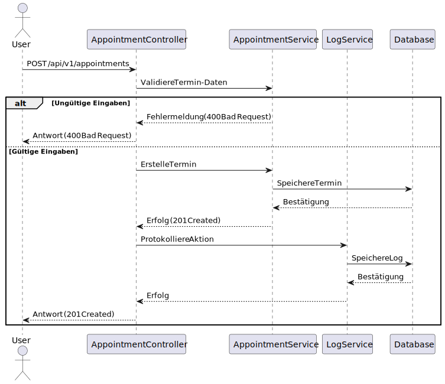
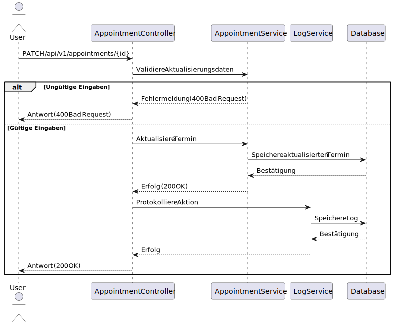

## /api/v1/appointments/

### POST `/api/v1/appointments/`

#### Beschreibung
Diese Route ermöglicht es Benutzern, einen neuen Termin zu erstellen. Der Benutzer muss dabei Start- und Enddatum, Teilnehmer (Benutzer-IDs und Kunden-IDs) sowie eine Beschreibung angeben.



---

#### Request-Body
Das Request-Body muss ein JSON-Objekt mit den folgenden Feldern enthalten:

| Feldname         | Typ     | Pflichtfeld | Beschreibung                                                                 |
|------------------|---------|-------------|-----------------------------------------------------------------------------|
| `startDate`      | String  | Ja          | Das Startdatum des Termins im ISO-8601-Format (`YYYY-MM-DDTHH:mm:ss`).    |
| `endDate`        | String  | Ja          | Das Enddatum des Termins im ISO-8601-Format (`YYYY-MM-DDTHH:mm:ss`).      |
| `userIds`        | Array   | Ja          | Eine Liste von Benutzer-IDs, die am Termin teilnehmen.                     |
| `customerIds`    | Array   | Ja          | Eine Liste von Kunden-IDs, die am Termin teilnehmen.                       |
| `organizerId`    | String  | Ja          | Die ID des Organisators des Termins.                                       |
| `description`    | String  | Ja          | Eine kurze Beschreibung des Termins.                                       |

##### Beispiel-Request-Body
```json
{
  "startDate": "2023-12-15T14:00:00",
  "endDate": "2023-12-15T15:00:00",
  "userIds": ["123e4567-e89b-12d3-a456-426614174000", "123e4567-e89b-12d3-a456-426614174001"],
  "customerIds": ["123e4567-e89b-12d3-a456-426614174002", "123e4567-e89b-12d3-a456-426614174003"],
  "organizerId": "123e4567-e89b-12d3-a456-426614174000",
  "description": "Besprechung über das neue Projekt"
}
```

---

#### Antwort

##### Erfolgreiche Erstellung (201 Created)
Wenn der Termin erfolgreich erstellt wurde, wird eine HTTP-Statuscode `201 Created` zurückgegeben, und der Response-Body enthält eine Bestätigungsnachricht.

###### Beispiel-Antwort
```json
{
  "message": "Appointment successfully created"
}
```

##### Ungültige Eingaben (400 Bad Request)
Wenn eines der Pflichtfelder fehlt oder ungültig ist, wird `400 Bad Request` zurückgegeben, und der Response-Body enthält eine Fehlermeldung.

###### Beispiel-Antwort
```json
{
  "title": "Invalid input data",
  "status": 400,
  "type": "https://javalin.io/documentation#badrequestresponse",
  "details": {
    "errors": [
      "Start time is required",
      "End time must be after start time"
    ]
  }
}
```

---

#### Implementierungshinweise
- Der Startzeitpunkt muss in der Zukunft liegen.
- Der Endzeitpunkt muss nach dem Startzeitpunkt liegen.
- Der Organisator muss Teil der `userIds`-Liste sein.
- Die Beschreibung darf nicht leer sein.

---

### PATCH `/api/v1/appointments/{id}`

#### Beschreibung
Diese Route ermöglicht es Benutzern, einen bestehenden Termin zu aktualisieren. Es werden nur die bereitgestellten Felder aktualisiert, wobei optional auch einzelne Attribute geändert werden können.

!

---

#### Path-Parameter

| Parametername | Typ     | Pflichtfeld | Beschreibung                                                                 |
|---------------|---------|-------------|-----------------------------------------------------------------------------|
| `id`          | String  | Ja          | Die eindeutige ID des zu aktualisierenden Termins.                          |

---

#### Request-Body
Das Request-Body kann ein JSON-Objekt mit den folgenden Feldern enthalten:

| Feldname         | Typ     | Pflichtfeld | Beschreibung                                                                 |
|------------------|---------|-------------|-----------------------------------------------------------------------------|
| `startDate`      | String  | Nein        | Das neue Startdatum des Termins im ISO-8601-Format (`YYYY-MM-DDTHH:mm:ss`).|
| `endDate`        | String  | Nein        | Das neue Enddatum des Termins im ISO-8601-Format (`YYYY-MM-DDTHH:mm:ss`).  |
| `userIds`        | Array   | Nein        | Eine aktualisierte Liste von Benutzer-IDs, die am Termin teilnehmen.       |
| `customerIds`    | Array   | Nein        | Eine aktualisierte Liste von Kunden-IDs, die am Termin teilnehmen.         |
| `organizerId`    | String  | Nein        | Die neue ID des Organisators des Termins.                                  |
| `description`    | String  | Nein        | Eine neue Beschreibung des Termins.                                         |

##### Beispiel-Request-Body
```json
{
  "startDate": "2023-12-16T14:00:00",
  "description": "Geänderte Besprechungsbeschreibung"
}
```

---

#### Antwort

##### Erfolgreiche Aktualisierung (200 OK)
Wenn der Termin erfolgreich aktualisiert wurde, wird eine HTTP-Statuscode `200 OK` zurückgegeben, und der Response-Body enthält eine Bestätigungsnachricht.

###### Beispiel-Antwort
```json
{
  "message": "Appointment successfully updated"
}
```

##### Termin nicht gefunden (404 Not Found)
Wenn der angegebene Termin nicht existiert, wird `404 Not Found` zurückgegeben.

###### Beispiel-Antwort
```json
{
  "title": "Appointment not found",
  "status": 404,
  "type": "https://javalin.io/documentation#notfoundresponse",
  "details": {}
}
```

---

#### Implementierungshinweise
- Nur bereitgestellte Felder werden aktualisiert; nicht angegebene Felder bleiben unverändert.
- Der Organisator muss weiterhin Teil der `userIds`-Liste sein, wenn diese geändert wird.

---

### DELETE `/api/v1/appointments/{id}/delete`

#### Beschreibung
Diese Route ermöglicht es Benutzern, einen bestehenden Termin zu löschen. Nur der Organisator des Termins oder Administratoren haben die Berechtigung, Termine zu löschen.

---

#### Path-Parameter

| Parametername | Typ     | Pflichtfeld | Beschreibung                                                                 |
|---------------|---------|-------------|-----------------------------------------------------------------------------|
| `id`          | String  | Ja          | Die eindeutige ID des zu löschenden Termins.                                |

---

#### Antwort

##### Erfolgreich gelöscht (200 OK)
Wenn der Termin erfolgreich gelöscht wurde, wird eine HTTP-Statuscode `200 OK` zurückgegeben, und der Response-Body enthält eine Bestätigungsnachricht.

###### Beispiel-Antwort
```json
{
  "message": "Appointment successfully deleted"
}
```

##### Keine Berechtigung (403 Forbidden)
Wenn der aktuelle Benutzer weder der Organisator noch ein Administrator ist, wird `403 Forbidden` zurückgegeben.

###### Beispiel-Antwort
```json
{
  "title": "You are not allowed to delete this appointment",
  "status": 403,
  "type": "https://javalin.io/documentation#forbiddenresponse",
  "details": {}
}
```

##### Termin nicht gefunden (404 Not Found)
Wenn der angegebene Termin nicht existiert, wird `404 Not Found` zurückgegeben.

###### Beispiel-Antwort
```json
{
  "title": "Appointment not found",
  "status": 404,
  "type": "https://javalin.io/documentation#notfoundresponse",
  "details": {}
}
```

---

#### Implementierungshinweise
- Nur der Organisator oder Administratoren können Termine löschen.