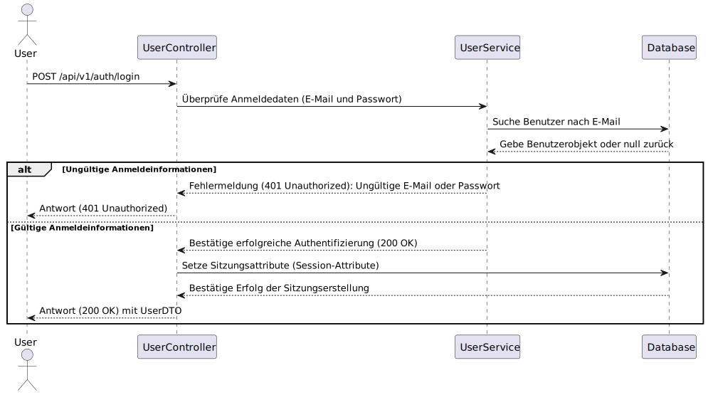
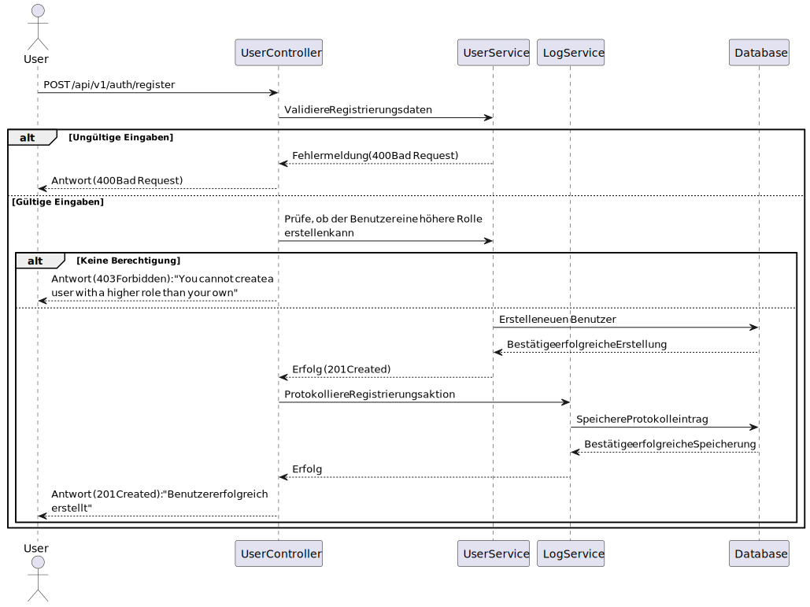

## /api/v1/auth/

### POST `/api/v1/auth/login`

#### Beschreibung
Diese Route ermöglicht es Benutzern, sich mit ihren Anmeldeinformationen (E-Mail und Passwort) anzumelden. Nach erfolgreicher Authentifizierung wird eine Sitzung erstellt, und die Details des angemeldeten Benutzers werden als JSON-Objekt zurückgegeben.



---

#### Request-Body
Das Request-Body muss ein JSON-Objekt mit den folgenden Feldern enthalten:

| Feldname   | Typ     | Pflichtfeld | Beschreibung                                                                 |
|------------|---------|-------------|-----------------------------------------------------------------------------|
| `email`    | String  | Ja          | Die E-Mail-Adresse des Benutzers.                                           |
| `password` | String  | Ja          | Das Passwort des Benutzers.                                                 |

##### Beispiel-Request-Body
```json
{
  "email": "benutzer@example.com",
  "password": "mein-sicheres-passwort"
}
```

---

#### Antwort
Die Antwort hängt davon ab, ob die Anmeldeinformationen gültig sind oder nicht.


##### Erfolgreiche Anmeldung (200 OK)
Wenn die Anmeldeinformationen korrekt sind, wird eine HTTP-Statuscode `200 OK` zurückgegeben, und das Response-Body enthält ein JSON-Objekt mit den Details des Benutzers.

| Feldname      | Typ     | Beschreibung                                                                 |
|---------------|---------|-----------------------------------------------------------------------------|
| `id`          | Integer | Die eindeutige ID des Benutzers.                                             |
| `email`       | String  | Die E-Mail-Adresse des Benutzers.                                           |
| `role`        | String  | Die Rolle des Benutzers (z.B. `CUSTOMER`, `EMPLOYEE`, `ADMIN`).             |

###### Beispiel-Antwort
```json
{
  "id": "57f8a1cd-82ed-49e9-bc00-51008a017f7a",
  "name": "admin",
  "surname": "admin",
  "email": "admin@admin.com",
  "role": "ADMIN"
}
```

##### Ungültige Anmeldeinformationen (401 Unauthorized)
Wenn die E-Mail oder das Passwort falsch sind, wird `401 Unauthorized` zurückgegeben, und der Response-Body enthält eine Fehlermeldung.

###### Beispiel-Antwort
```json
{
  "title": "Invalid email or password",
  "status: 401,
  "type": "https://javalin.io/documentation#unauthorizedresponse",
  "details": {}
}
```

---

#### Implementierungshinweise
- Bei erfolgreicher Authentifizierung wird ein Sitzungsattribut (`user`) mit dem Benutzerobjekt gesetzt, damit der Benutzer in der Anwendung identifiziert werden kann.
- Das Passwort wird niemals im Klartext gespeichert oder übertragen. Stattdessen wird ein Hash des Passworts mit einem [Salt](https://en.wikipedia.org/wiki/Salt_(cryptography)) mit Argon2 erstellt und gespeichert.

---

### POST `/api/v1/auth/register`

#### Beschreibung
Diese Route ermöglicht es einem Administrator, einen neuen Benutzer zu registrieren. Der authentifizierte Benutzer muss die Berechtigung haben, einen Benutzer mit der gewünschten Rolle zu erstellen. Bei erfolgreicher Registrierung wird ein Protokolleintrag erstellt und der Client erhält eine Bestätigung.



---

#### Request-body
Das Request-Body muss ein JSON-Objekt mit den folgenden Feldern enthalten:

| Feldname   | Typ     | Pflichtfeld | Beschreibung                                                                 |
|------------|---------|-------------|-----------------------------------------------------------------------------|
| `email`    | String  | Ja          | Die E-Mail-Adresse des neuen Benutzers.                                     |
| `password` | String  | Ja          | Das Passwort des neuen Benutzers.                                           |
| `name`     | String  | Ja          | Der Vorname des neuen Benutzers.                                            |
| `surname`  | String  | Ja          | Der Nachname des neuen Benutzers.                                           |
| `role`     | Enum    | Ja          | Die Rolle des neuen Benutzers (z.B. `CUSTOMER`, `EMPLOYEE`, `ADMIN`).       |

##### Beispiel-Request-Body
```json
{
  "email": "neuerbenutzer@example.com",
  "password": "sicheres-passwort",
  "name": "Max",
  "surname": "Mustermann",
  "role": 2
}
```

---

#### Antwort
Die Antwort hängt davon ab, ob die Registrierung erfolgreich war oder nicht.

##### Erfolgreiche Registrierung (201 Created)
Wenn die Registrierung erfolgreich ist, wird eine HTTP-Statuscode `201 Created` zurückgegeben, und der Response-Body enthält eine Bestätigungsnachricht.

###### Beispiel-Antwort
```
User successfully created
```

##### Fehlende oder ungültige Eingaben (400 Bad Request)
Wenn erforderliche Felder fehlen oder ungültig sind, wird eine HTTP-Statuscode `400 Bad Request` zurückgegeben, und der Response-Body enthält eine Fehlermeldung.

###### Beispiel-Antwort
```json
{
  "REQUEST_BODY": [
    {
        "message": "Password is required",
        "args": {},
        "value": {
            "name": "Max",
            "surname": "Mustermann",
            "email": "neuerenutzer@example.com",
            "password": null,
            "role": "EMPLOYEE"
        }
    }
  ]
}
```

##### Keine Berechtigung (403 Forbidden)
Wenn der authentifizierte Benutzer versucht, einen Benutzer mit einer höheren Rolle zu erstellen, wird eine HTTP-Statuscode `403 Forbidden` zurückgegeben.

###### Beispiel-Antwort
```json
{
  "title": "You cannot create a user with a higher role than your own",
  "status": 400,
  "type": "https://javalin.io/documentation#badrequestresponse",
  "details": {}
}
```