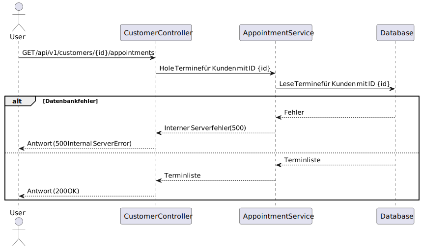

## /api/v1/customers/

### POST `/api/v1/customers/`

#### Beschreibung
Diese Route ermöglicht es Administratoren und Mitarbeitern, einen neuen Kunden anzulegen. Es werden grundlegende Informationen wie Name, Nachname, E-Mail-Adresse, Firma und verantwortlicher Manager benötigt.

!

---

#### Request-Body
Das Request-Body muss ein JSON-Objekt mit den folgenden Feldern enthalten:

| Feldname              | Typ     | Pflichtfeld | Beschreibung                                                                 |
|-----------------------|---------|-------------|-----------------------------------------------------------------------------|
| `name`               | String  | Ja          | Der Vorname des Kunden.                                                     |
| `surname`            | String  | Ja          | Der Nachname des Kunden.                                                    |
| `email`              | String  | Ja          | Die E-Mail-Adresse des Kunden.                                              |
| `company`            | String  | Ja          | Der Name der Firma, für die der Kunde arbeitet.                             |
| `assignedManagerId`  | UUID    | Ja          | Die ID des verantwortlichen Managers für diesen Kunden.                     |
| `phoneNumber`        | String  | Nein        | Die Telefonnummer des Kunden (optional).                                    |
| `contactStatus`      | String  | Nein        | Der Status des Kontakts mit dem Kunden (optional).                          |
| `address`            | String  | Nein        | Die Adresse des Kunden (optional).                                          |

##### Beispiel-Request-Body
```json
{
  "name": "Max",
  "surname": "Mustermann",
  "email": "max.mustermann@example.com",
  "company": "Beispiel GmbH",
  "assignedManagerId": "57f8a1cd-82ed-49e9-bc00-51008a017f7a",
  "phoneNumber": "+49123456789",
  "contactStatus": "NEW",
  "address": "Musterstraße 123, 12345 Musterstadt"
}
```

---

#### Antwort

##### Erfolgreiche Erstellung (201 Created)
Wenn der Kunde erfolgreich erstellt wurde, wird eine HTTP-Statuscode `201 Created` zurückgegeben, und der Response-Body enthält eine Bestätigungsnachricht.

###### Beispiel-Antwort
```json
{
  "result": "Customer successfully created"
}
```

##### Fehler bei der Erstellung (400 Bad Request oder 404 Not Found)
Falls erforderliche Felder fehlen oder der zugewiesene Manager nicht gefunden wird, wird ein Fehler zurückgegeben.

###### Beispiel-Antwort
```json
{
  "title": "Assigned manager not found",
  "status": 404,
  "type": "https://javalin.io/documentation#notfoundresponse",
  "details": {}
}
```

---

### GET `/api/v1/customers/`

#### Beschreibung
Diese Route gibt eine Liste aller Kunden im System zurück. Nur Administratoren und Mitarbeiter können auf diese Route zugreifen.

!

---

#### Antwort

##### Erfolgreiche Abfrage (200 OK)
Wenn die Anfrage erfolgreich ist, wird eine HTTP-Statuscode `200 OK` zurückgegeben, und der Response-Body enthält eine Liste mit allen Kunden.

###### Beispiel-Antwort
```json
[
  {
    "id": "57f8a1cd-82ed-49e9-bc00-51008a017f7a",
    "name": "Max",
    "surname": "Mustermann",
    "email": "max.mustermann@example.com",
    "company": "Beispiel GmbH",
    "phoneNumber": "+49123456789",
    "contactStatus": "NEW",
    "address": "Musterstraße 123, 12345 Musterstadt"
  },
  {
    "id": "123e4567-e89b-12d3-a456-426614174000",
    "name": "Anna",
    "surname": "Musterfrau",
    "email": "anna.musterfrau@example.com",
    "company": "Test AG",
    "phoneNumber": "+49987654321",
    "contactStatus": "EXISTING",
    "address": "Teststraße 456, 65432 Teststadt"
  }
]
```

---

### GET `/api/v1/customers/{id}`

#### Beschreibung
Diese Route gibt Details zu einem bestimmten Kunden basierend auf seiner eindeutigen ID zurück. Nur Administratoren und Mitarbeiter können auf diese Route zugreifen.

!

---

#### Parameter

| Parametername | Typ   | Pflichtfeld | Beschreibung                                                                 |
|---------------|-------|-------------|-----------------------------------------------------------------------------|
| `id`          | UUID  | Ja          | Die eindeutige ID des Kunden, dessen Daten abgerufen werden sollen.         |

---

#### Antwort

##### Erfolgreiche Abfrage (200 OK)
Wenn der Kunde gefunden wird, wird eine HTTP-Statuscode `200 OK` zurückgegeben, und der Response-Body enthält die Kundendetails.

###### Beispiel-Antwort
```json
{
  "id": "57f8a1cd-82ed-49e9-bc00-51008a017f7a",
  "name": "Max",
  "surname": "Mustermann",
  "email": "max.mustermann@example.com",
  "company": "Beispiel GmbH",
  "phoneNumber": "+49123456789",
  "contactStatus": "NEW",
  "address": "Musterstraße 123, 12345 Musterstadt"
}
```

##### Fehler bei der Abfrage (404 Not Found)
Wenn kein Kunde mit der angegebenen ID gefunden wird, wird ein Fehler zurückgegeben.

###### Beispiel-Antwort
```json
{
  "title": "Customer not found",
  "status": 404,
  "type": "https://javalin.io/documentation#notfoundresponse",
  "details": {}
}
```

---

### GET `/api/v1/customers/{id}/appointments`

#### Beschreibung
Diese Route gibt alle Termine eines bestimmten Kunden basierend auf seiner eindeutigen ID zurück. Nur Administratoren und Mitarbeiter können auf diese Route zugreifen.

!

---

#### Parameter

| Parametername | Typ   | Pflichtfeld | Beschreibung                                                                 |
|---------------|-------|-------------|-----------------------------------------------------------------------------|
| `id`          | UUID  | Ja          | Die eindeutige ID des Kunden, dessen Termine abgerufen werden sollen.       |

---

#### Antwort

##### Erfolgreiche Abfrage (200 OK)
Wenn die Anfrage erfolgreich ist, wird eine HTTP-Statuscode `200 OK` zurückgegeben, und der Response-Body enthält eine Liste mit allen Terminen des Kunden.

###### Beispiel-Antwort
```json
[
  {
    "id": "123e4567-e89b-12d3-a456-426614174001",
    "date": "2023-10-01T10:00:00Z",
    "description": "Besprechung über neue Produkte"
  },
  {
    "id": "123e4567-e89b-12d3-a456-426614174002",
    "date": "2023-10-05T14:30:00Z",
    "description": "Follow-up Besprechung"
  }
]
```

---

### PATCH `/api/v1/customers/{id}`

#### Beschreibung
Diese Route aktualisiert die Details eines vorhandenen Kunden basierend auf seiner eindeutigen ID. Es können nur die bereitgestellten Felder aktualisiert werden.

!

---

#### Parameter

| Parametername | Typ   | Pflichtfeld | Beschreibung                                                                 |
|---------------|-------|-------------|-----------------------------------------------------------------------------|
| `id`          | UUID  | Ja          | Die eindeutige ID des Kunden, dessen Daten aktualisiert werden sollen.      |

---

#### Request-Body
Das Request-Body muss ein JSON-Objekt mit den zu aktualisierenden Feldern enthalten.

| Feldname              | Typ     | Pflichtfeld | Beschreibung                                                                 |
|-----------------------|---------|-------------|-----------------------------------------------------------------------------|
| `name`               | String  | Nein        | Der neue Vorname des Kunden (optional).                                     |
| `surname`            | String  | Nein        | Der neue Nachname des Kunden (optional).                                    |
| `email`              | String  | Nein        | Die neue E-Mail-Adresse des Kunden (optional).                              |
| `company`            | String  | Nein        | Der neue Firmenname des Kunden (optional).                                  |
| `assignedManagerId`  | UUID    | Nein        | Die neue ID des verantwortlichen Managers (optional).                       |
| `phoneNumber`        | String  | Nein        | Die neue Telefonnummer des Kunden (optional).                               |
| `contactStatus`      | String  | Nein        | Der neue Kontaktstatus des Kunden (optional).                               |
| `address`            | String  | Nein        | Die neue Adresse des Kunden (optional).                                     |

##### Beispiel-Request-Body
```json
{
  "name": "Maximilian",
  "email": "max.mustermann@update.com",
  "assignedManagerId": "123e4567-e89b-12d3-a456-426614174000"
}
```

---

#### Antwort

##### Erfolgreiche Aktualisierung (200 OK)
Wenn der Kunde erfolgreich aktualisiert wurde, wird eine HTTP-Statuscode `200 OK` zurückgegeben, und der Response-Body enthält eine Bestätigungsnachricht.

###### Beispiel-Antwort
```json
{
  "result": "Customer successfully updated"
}
```

---

### DELETE `/api/v1/customers/{id}`

#### Beschreibung
Diese Route löscht einen Kunden basierend auf seiner eindeutigen ID. Diese Aktion kann nicht rückgängig gemacht werden.

!

---

#### Parameter

| Parametername | Typ   | Pflichtfeld | Beschreibung                                                                 |
|---------------|-------|-------------|-----------------------------------------------------------------------------|
| `id`          | UUID  | Ja          | Die eindeutige ID des Kunden, der gelöscht werden soll.                     |

---

#### Antwort

##### Erfolgreiche Löschung (200 OK)
Wenn der Kunde erfolgreich gelöscht wurde, wird eine HTTP-Statuscode `200 OK` zurückgegeben, und der Response-Body enthält eine Bestätigungsnachricht.

###### Beispiel-Antwort
```json
{
  "result": "Customer successfully deleted"
}
```