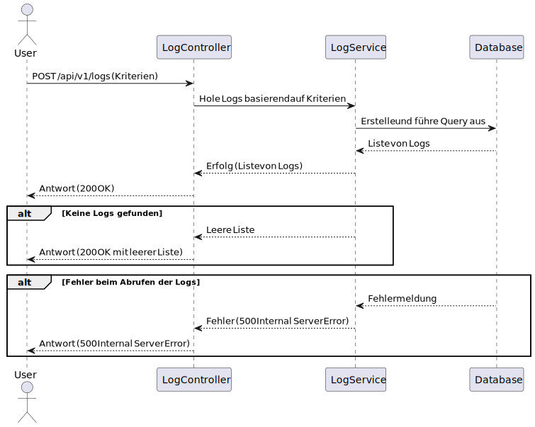

## /api/v1/logs/

### GET `/api/v1/logs`

#### Beschreibung
Diese Route ermöglicht es, Protokolleinträge (Logs) aus dem System abzurufen. Es können Filterkriterien wie Zeitraum, Benutzer-ID und Log-Typ übergeben werden, um die Ergebnisse zu spezifizieren.



---

#### Request-Body
Das Request-Body muss ein JSON-Objekt mit den folgenden optionalen Feldern enthalten:

| Feldname    | Typ       | Pflichtfeld | Beschreibung                                                                 |
|-------------|-----------|-------------|-----------------------------------------------------------------------------|
| `startDate` | DateTime  | Nein        | Der Startzeitpunkt für die Abfrage der Logs.                                |
| `endDate`   | DateTime  | Nein        | Der Endzeitpunkt für die Abfrage der Logs.                                  |
| `userId`    | UUID      | Nein        | Die ID des Benutzers, dessen Logs abgerufen werden sollen.                  |
| `logType`   | Integer    | Nein        | Der Typ der Logs, die abgerufen werden sollen.       |

##### Beispiel-Request-Body
```json
{
  "startDate": "2023-10-01T00:00:00Z",
  "endDate": "2023-10-31T23:59:59Z",
  "userId": "57f8a1cd-82ed-49e9-bc00-51008a017f7a",
  "logType": 6
}
```

---

#### Antwort

##### Erfolgreiche Abfrage (200 OK)
Wenn die Abfrage erfolgreich ist, wird eine HTTP-Statuscode `200 OK` zurückgegeben, und das Response-Body enthält eine Liste von Log-Objekten im JSON-Format.

| Feldname     | Typ       | Beschreibung                                                                 |
|--------------|-----------|-----------------------------------------------------------------------------|
| `id`         | UUID      | Die eindeutige ID des Log-Eintrags.                                         |
| `message`    | String    | Die Nachricht des Log-Eintrags.                                             |
| `type`       | Integer    | Der Typ des Log-Eintrags                             |
| `timestamp`  | DateTime  | Der Zeitstempel des Log-Eintrags.                                           |
| `user_id`    | UUID      | Die ID des Benutzers, der den Log-Eintrag erstellt hat.                     |

###### Beispiel-Antwort
```json
[
    {
        "id": "4e7c14f1-e6ec-4410-b0e2-8a0a17ad0ff5",
        "message": "User admin admin created a new appointment",
        "timestamp": "28.02.2025 21:26:22",
        "type": "CREATED_APPOINTMENT",
        "userId": "57f8a1cd-82ed-49e9-bc00-51008a017f7a"
    }
]
```

##### Keine Ergebnisse gefunden (200 OK)
Wenn keine Logs gefunden werden, wird ebenfalls eine HTTP-Statuscode `200 OK` zurückgegeben, aber die Response-Liste bleibt leer.

###### Beispiel-Antwort
```json
[]
```

---

#### Implementierungshinweise
- Die Logs werden mithilfe eines JPA-Criteria-Queries abgerufen, um flexible Filtermöglichkeiten bereitzustellen.
- Alle Parameter sind optional, sodass ohne Kriterien alle Logs zurückgegeben werden.