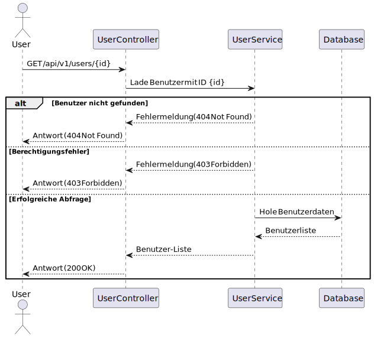
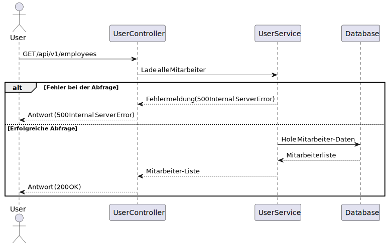
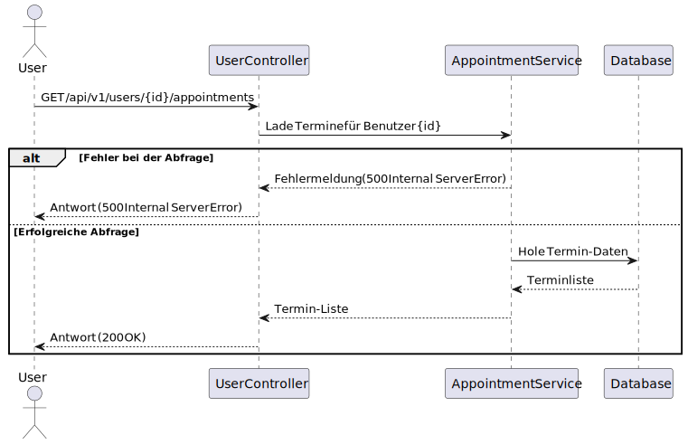
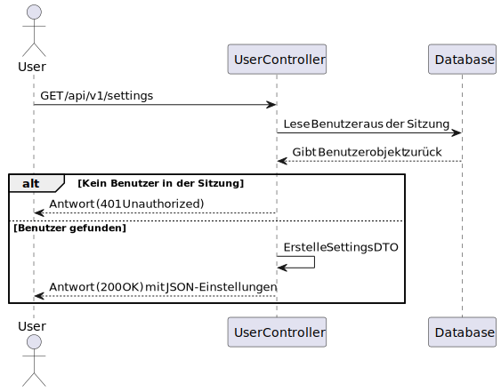
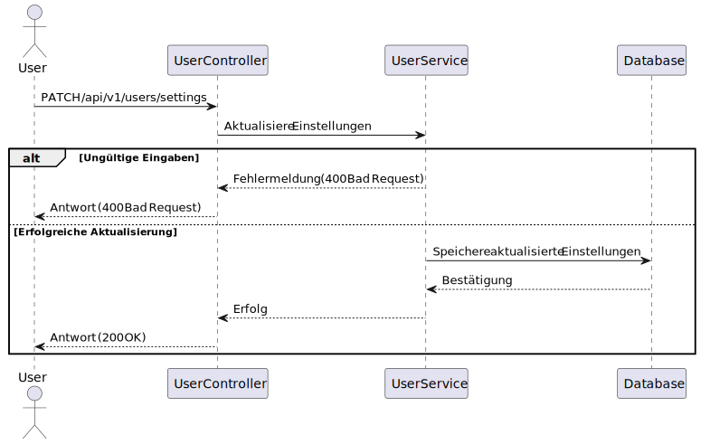

## /api/v1/users/

### GET `/api/v1/users`

#### Beschreibung
Diese Route gibt eine Liste aller Benutzer im System zurück. Diese Route ist nur für Administratoren zugänglich.


---

#### Antwort

##### Erfolgreiche Abfrage (200 OK)
Wenn der angemeldete Benutzer Administratorrechte hat, wird eine HTTP-Statuscode `200 OK` zurückgegeben, und das Response-Body enthält eine JSON-Liste mit allen Benutzern.

###### Beispiel-Antwort
```json
[
  {
    "id": "57f8a1cd-82ed-49e9-bc00-51008a017f7a",
    "name": "admin",
    "surname": "admin",
    "email": "admin@admin.com",
    "role": "ADMIN"
  },
  {
    "id": "57f8a1cd-82ed-49e9-bc00-51008a017f7b",
    "name": "Max",
    "surname": "Mustermann",
    "email": "neuerbenutzer@example.com",
    "role": "CUSTOMER"
  }
]
```

##### Zugriffsverweigerung (403 Forbidden)
Wenn der angemeldete Benutzer keine Administratorrechte hat, wird `403 Forbidden` zurückgegeben.

###### Beispiel-Antwort
```json
{
  "title": "Forbidden",
  "status": 403,
  "type": "https://javalin.io/documentation#forbiddenresponse",
  "details": {}
}
```

---

### GET `/api/v1/users/{id}`

#### Beschreibung
Diese Route gibt die Details eines spezifischen Benutzers basierend auf seiner ID zurück. Es wird eine Rollenüberprüfung durchgeführt, um sicherzustellen, dass der angemeldete Benutzer nicht die Details eines Benutzers mit höheren Rechten abruft.



---

#### Parameter

| Parametername | Typ     | Pflichtfeld | Beschreibung                                                                 |
|---------------|---------|-------------|-----------------------------------------------------------------------------|
| `id`          | String    | Ja          | Die eindeutige ID des Benutzers, dessen Details abgerufen werden sollen.    |

---

#### Antwort

##### Erfolgreiche Abfrage (200 OK)
Wenn der Benutzer gefunden wurde und der angemeldete Benutzer die erforderlichen Rechte hat, wird eine HTTP-Statuscode `200 OK` zurückgegeben, und das Response-Body enthält ein JSON-Objekt mit den Details des Benutzers.

###### Beispiel-Antwort
```json
{
  "id": "57f8a1cd-82ed-49e9-bc00-51008a017f7a",
  "name": "admin",
  "surname": "admin",
  "email": "admin@admin.com",
  "role": "ADMIN"
}
```

##### Benutzer nicht gefunden (404 Not Found)
Wenn der angegebene Benutzer nicht existiert, wird `404 Not Found` zurückgegeben.

###### Beispiel-Antwort
```json
{
  "title": "User not found",
  "status": 404,
  "type": "https://javalin.io/documentation#notfoundresponse",
  "details": {}
}
```

##### Zugriffsverweigerung (403 Forbidden)
Wenn der angemeldete Benutzer versucht, die Details eines Benutzers mit höheren Rechten abzurufen, wird `403 Forbidden` zurückgegeben.

###### Beispiel-Antwort
```json
{
  "title": "You cannot view a user with a higher role than your own",
  "status": 403,
  "type": "https://javalin.io/documentation#forbiddenresponse",
  "details": {}
}
```

---

### GET `/api/v1/users/employees`

#### Beschreibung
Diese Route gibt eine Liste aller Mitarbeiter (Employees) im System zurück. Nur Benutzer mit Administrator- oder Mitarbeiter-Rollen haben Zugriff auf diese Route.



---

#### Antwort

##### Erfolgreiche Abfrage (200 OK)
Wenn der angemeldete Benutzer die erforderlichen Rechte hat, wird eine HTTP-Statuscode `200 OK` zurückgegeben, und das Response-Body enthält eine JSON-Liste mit allen Mitarbeitern.

###### Beispiel-Antwort
```json
[
  {
    "id": "57f8a1cd-82ed-49e9-bc00-51008a017f7c",
    "name": "Jane",
    "surname": "Doe",
    "email": "jane.doe@example.com",
    "role": "EMPLOYEE"
  },
  {
    "id": "57f8a1cd-82ed-49e9-bc00-51008a017f7d",
    "name": "John",
    "surname": "Smith",
    "email": "john.smith@example.com",
    "role": "EMPLOYEE"
  }
]
```

##### Zugriffsverweigerung (403 Forbidden)
Wenn der angemeldete Benutzer keine Administrator- oder Mitarbeiter-Rolle hat, wird `403 Forbidden` zurückgegeben.

###### Beispiel-Antwort
```json
{
  "title": "You are not authorized to access this resource",
  "status": 403,
  "type": "https://javalin.io/documentation#forbiddenresponse",
  "details": {}
}
```

---

### GET `/api/v1/users/{id}/appointments`

#### Beschreibung
Diese Route gibt alle Termine eines spezifischen Benutzers basierend auf seiner ID zurück. Nur Benutzer mit Administrator- oder Mitarbeiter-Rollen haben Zugriff auf diese Route.



---

#### Parameter

| Parametername | Typ     | Pflichtfeld | Beschreibung                                                                 |
|---------------|---------|-------------|-----------------------------------------------------------------------------|
| `id`          | UUID    | Ja          | Die  ID des Benutzers, dessen Termine abgerufen werden sollen.    |

---

#### Antwort

##### Erfolgreiche Abfrage (200 OK)
Wenn der Benutzer gefunden wurde und der angemeldete Benutzer die erforderlichen Rechte hat, wird eine HTTP-Statuscode `200 OK` zurückgegeben, und das Response-Body enthält eine JSON-Liste mit den Terminen des Benutzers.

###### Beispiel-Antwort
```json
[
  {
    "id": "b8f2e0c9-6d8e-4b7f-9a6f-3d2e8c1a4f56",
    "startTime": "15.10.2023 13:00:00",
    "endTime": "15.10.2023 14:00:00",
    "description": "Diskussion über die Einfuehrung neuer Produkte",
    "participants": [
      {
        "id": "2722bd27-d8f4-4d6f-9f9b-62582ee023ae",
        "name": "Markus",
        "userId": "cb25da78-d6f4-4218-a40f-eb465844df76",
        "customerId": null,
        "role": "ORGANIZER"
      },
      {
        "id": "63048879-b4c9-48df-bc36-7be71d9b6ccb",
        "name": "Lisa",
        "userId": "f7dff772-3803-4946-8b5a-8f6605bcb9f3",
        "customerId": null,
        "role": "PARTICIPANT"
      }
    ]
  },
]
```

---

#### Implementierungshinweise
- Es wird eine Rollenüberprüfung durchgeführt, um sicherzustellen, dass nur autorisierte Benutzer auf die Termindaten zugreifen können.


---

### GET `/api/v1/users/settings`

#### Beschreibung
Diese Route gibt die aktuellen Einstellungen des angemeldeten Benutzers zurück.



---

#### Antwort

##### Erfolgreiche Abfrage (200 OK)
Wenn der Benutzer erfolgreich authentifiziert ist, wird eine HTTP-Statuscode `200 OK` zurückgegeben, und das Response-Body enthält ein JSON-Objekt mit den Einstellungen des Benutzers.

###### Beispiel-Antwort
```json
{
  "darkMode": true,
  "languageGerman": false
}
```

---

### PATCH `/api/v1/users/settings`

#### Beschreibung
Diese Route ermöglicht es dem angemeldeten Benutzer, seine Einstellungen zu aktualisieren.


---

#### Request-Body
Das Request-Body muss ein JSON-Objekt mit den folgenden Feldern enthalten:

| Feldname       | Typ     | Pflichtfeld | Beschreibung                                                                 |
|----------------|---------|-------------|-----------------------------------------------------------------------------|
| `darkMode`     | Boolean | Nein        | Aktiviert oder deaktiviert den Dunkelmodus.                                 |
| `languageGerman` | Boolean | Nein        | Legt fest, ob die Sprache Deutsch ist.                                      |

##### Beispiel-Request-Body
```json
{
  "darkMode": true,
  "languageGerman": true
}
```

---

#### Antwort

##### Erfolgreiche Aktualisierung (200 OK)
Wenn die Einstellungen erfolgreich aktualisiert wurden, wird eine HTTP-Statuscode `200 OK` zurückgegeben, und der Response-Body enthält eine Bestätigungsnachricht.

###### Beispiel-Antwort
```json
{
  "message": "Settings successfully updated"
}
```

##### Ungültige Anfrage (400 Bad Request)
Wenn das übergebene JSON ungültig ist, wird `400 Bad Request` zurückgegeben.


---

#### Implementierungshinweise
- Die Einstellungen werden in der Datenbank gespeichert und im `user` Sitzungsattribut aktualisiert.
