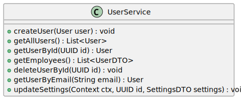
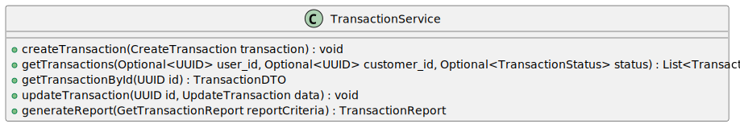
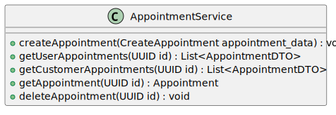
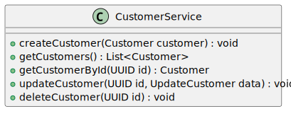
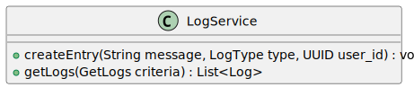

# Dienste
Worksale ist MVC/MVSC basiert was bedeutet, dass die Anwendung in Model, Services (Dienste) und Controller unterteilt ist. Die Services sind eine Erweiterung des MVC/MVSC Musters und enthalten die Kernlogik der Anwendung. Sie koordinieren den Datenaustausch zwischen Models und Controllers.

## Übersicht

### UserService
Der UserService ist zuständig für alle Benutzeroperationen. Er ermöglicht das Erstellen, Lesen, Aktualisieren und Löschen von Benutzerdaten. 

!

### TransactionService
Der `TransactionService` übernimmt die Verwaltung von Transaktionen. Er führt Transaktionsoperationen wie das Erstellen, Abrufen und Aktualisieren von Transaktionen durch.

!

### AppointmentService
Der `AppointmentService` ist verantwortlich für die Verwaltung von Terminen. Er ermöglicht das Erstellen, Abrufen und Aktualisieren von Terminen.
!

### CustomerService
Der `CustomerService` kümmert sich um die Verwaltung von Kunden. Er ermöglicht das Erstellen, Abrufen und Aktualisieren von Kundendaten.

!

### LogService
Der `LogService` ist verantwortlich für die Verwaltung von Log-Daten. Er ermöglicht das Abrufen sowie Erstellen von Log-Daten.
!

## Zusammenfassung
Jeder Service in diesem System hat eine klare Aufgabe und interagiert mit den entsprechenden Modellen oder anderen Diensten, um die notwendigen CRUD-Vorgänge durchzuführen.